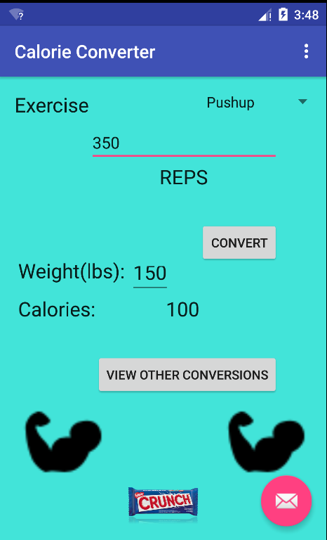
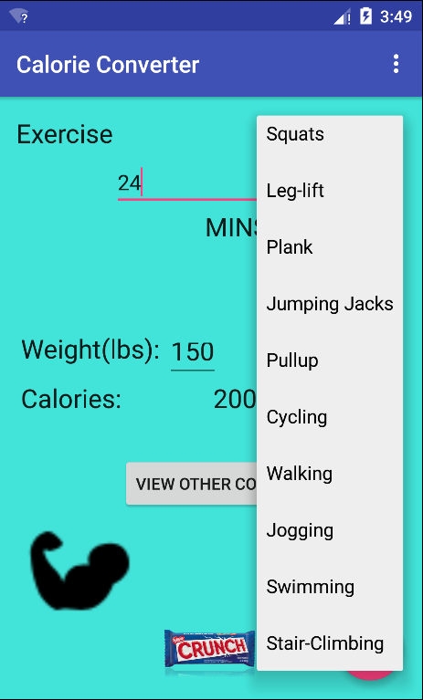
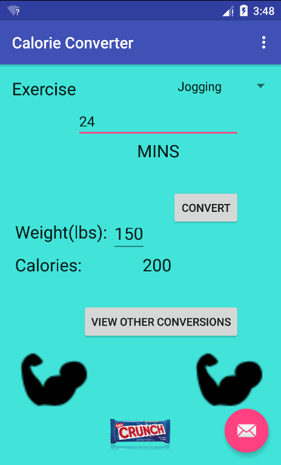
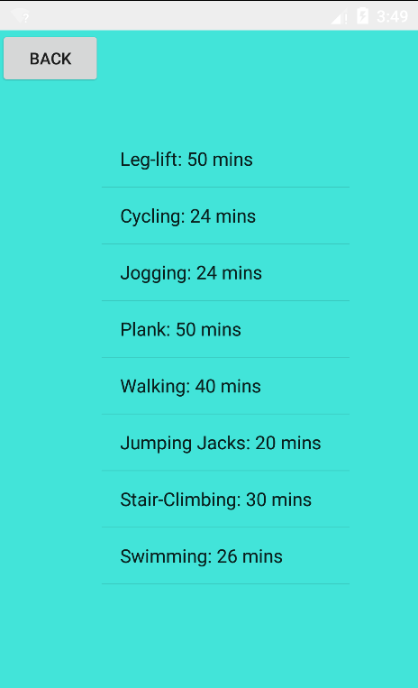

# PROG 01: Crunch Time

Candy Crunch Time is an application that tries to crush/("crunch") all the calories gained by eating candy bars (such as the infamous Crunch Bar) by providing the user with a number of calories burned for a certain intensity workout. Upon opening the home screen, the user is greeted with preselected parameters and values specific to the pushup exercise. At this point, the user should select which exercise he performed using the drop down menu. After selecting the exercise, the user is greeted with two snackbars. One of these snackbars shows which exercise was selected. Below the first snackbar is another snackbar, the arch enemy of good health. The user can choose to input his weight as well. Upon entering the desired reps or minutes of the chosen exercise, the user can click convert to determine how many calories were burned by performing said exercise. The user can also click "View Other Conversions", which redirects to another page showing all of the exercises that would burn the same amount of calories. The user can then chose to click the back button which will return them to the home screen.
In addition the the requirements of the project, this application has a weight entry panel, all twelve exercises and iconography.

## Authors

Keshav Thvar ([kthvar@berkeley.edu](mailto:kthvar@berkeley.edu))

## Demo Video

See [CANDY CRUNCH TIME] (https://vimeo.com/154352108)

## Screenshots

## Acknowledgments

* StackOverflow was an invaluable resource for learning how to code xml as well as understand Android
* Used this as a resource to create ListView (http://androidexample.com/Create_A_Simple_Listview_-_Android_Example/index.php?view=article_discription&aid=65&aaid=90)

