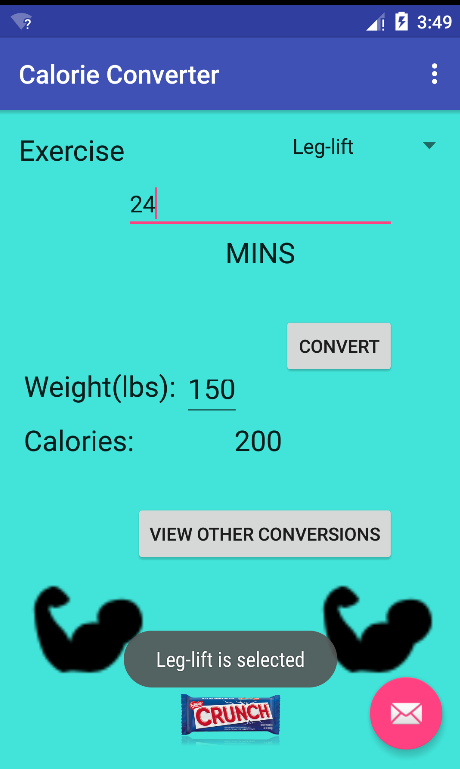

# PROG 01: Crunch Time

Briefly describe your app here.

## Authors

Keshav Thvar ([kthvar@berkeley.edu](mailto:kthvar@berkeley.edu))

## Demo Video

See [your demo video title here] (https://link_to_your_video)

## Screenshots

## Acknowledgments

* StackOverflow was an invaluable resource for learning how to code xml as well as understand Android
* Used this as a resource to create ListView (http://androidexample.com/Create_A_Simple_Listview_-_Android_Example/index.php?view=article_discription&aid=65&aaid=90)

